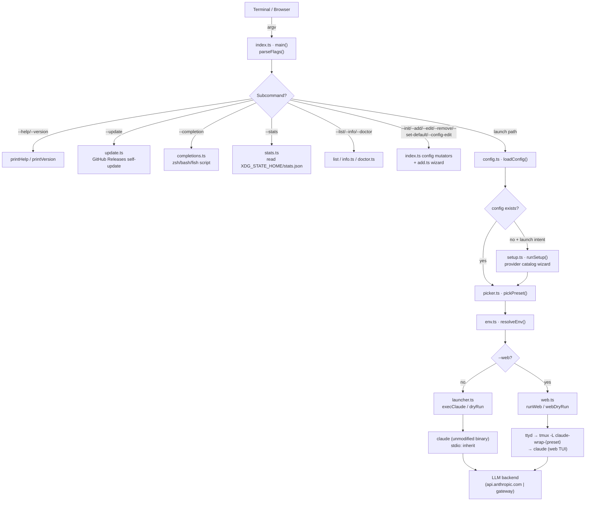
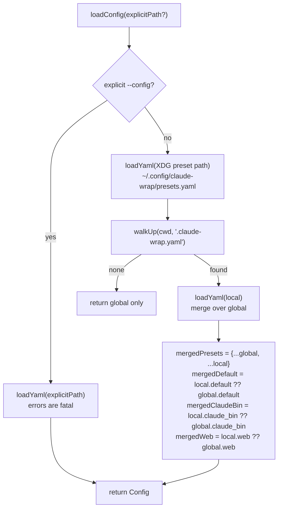
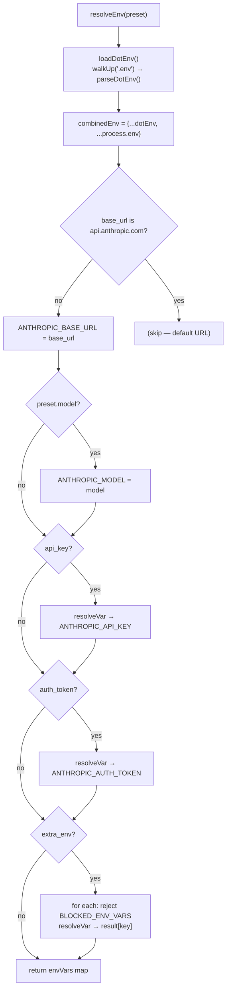
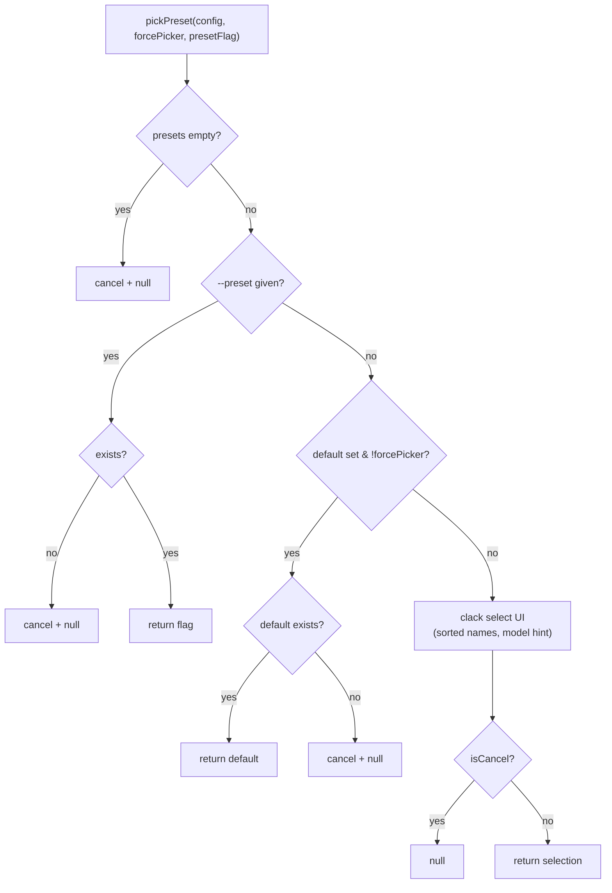
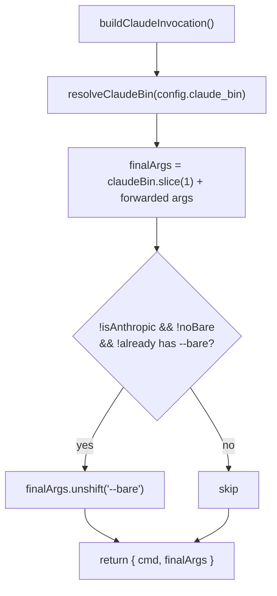
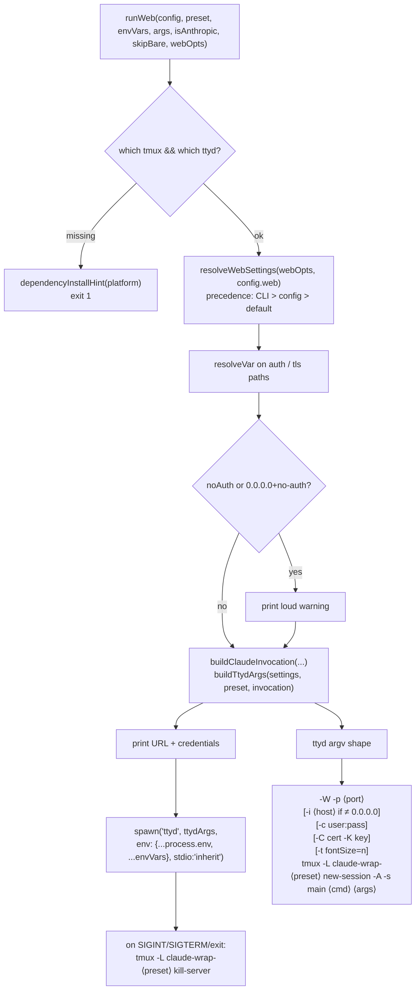
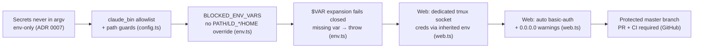
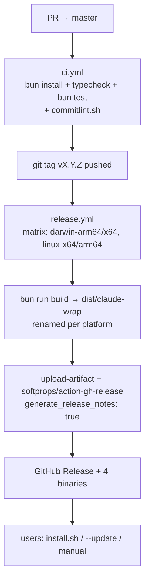

# claude-wrap — Architecture & Flow

`claude-wrap` is a thin, dependency-injecting **launcher** for the stock
[Claude Code](https://github.com/anthropics/claude-code) CLI. It never forks or
patches Claude Code — it resolves a *preset* (model + base URL + credentials)
from YAML config, builds a clean `ANTHROPIC_*` environment, and `exec`s the
unmodified `claude` binary. The `--web` subcommand wraps that same launch in a
persistent `tmux` session served over HTTP by `ttyd`.

This document traces the **control flow** and **data flow** through every module.
All module paths are under `src/`.

---

## 1. System overview



The launch path (`config → pick → env → launch`) is the spine; everything else is
a maintenance/diagnostic branch that exits before reaching it.

---

## 2. Entry point & dispatch — `index.ts`

`parseFlags()` walks `process.argv` and returns a flat `flags` object. Two
conventions matter:

- **Value flags** (`--preset`, `--config`, `--web-port`, …) consume the next
  argument and fail with `exit(1)` if it is missing or malformed (ports 1–65535,
  font-size > 0).
- **Everything after `--`** is treated as claude passthrough args (`result.args`),
  separated from wrapper flags by a hard boundary (ADR 0014).

`main()` then dispatches **top-to-bottom**; most branches `process.exit()` before
reaching the launch spine:

```mermaid
flowchart TD
    START["main()"] --> PF["parseFlags()"]
    PF --> HELP{"--help?"} -->|yes| EXITH["printHelp · exit 0"]
    PF --> VER{"--version?"} -->|yes| EXITV["printVersion · exit 0"]
    HELP -->|no UPD["--update?"] -->|yes| RUNUPD["runUpdate() · exit"]
    UPD -->|no CMP["--completion?"] -->|yes| RUNCMP["generateCompletion · exit 0"]
    CMP -->|no ST["--stats?"] -->|yes| RUNST["showStats() · exit"]
    ST -->|no CE["--config-edit?"] --> RUNCE["doConfigEdit · exit"]
    RUNCE --> SD["--set-default?"] -->|yes| RUNSD["doSetDefault · exit"]
    SD --> RM["--remove?"] -->|yes| RUNRM["doRemove · exit"]
    RM --> ED["--edit?"] -->|yes| RUNED["doEdit · exit"]
    ED --> ADD["--add?"] -->|yes| RUNADD["runAdd() · exit"]
    ADD --> INIT["--init?"] -->|yes| RUNINIT["doInit · exit"]
    INIT --> LOAD["loadConfig(flags.config)"]
    LOAD --> INFO{"--info?"} -->|yes| RUNINFO["showInfo · exit"]
    INFO --> DOC{"--doctor?"} -->|yes| RUNDOC["runDoctor · exit"]
    DOC --> SES["session? → unshift --continue/--resume onto args"]
    SES --> PICK["pickPreset(config, pick, preset)"]
    PICK --> WHICH{"--which?"} -->|yes| EXITW["print name · exit 0"]
    WHICH --> RENV["resolveEnv(preset)"]
    RENV --> WEB{"--web?"}
    WEB -->|yes DRYW["--dry-run?"] -->|yes| WD["webDryRun · exit 0"]
    DRYW -->|no| RUNW["runWeb() · return"]
    WEB -->|no DRYL["--dry-run?"] -->|yes| LD["dryRun · exit 0"]
    DRYL -->|no EXP["--export?"] -->|yes| LE["print exports · exit 0"]
    EXP -->|no| EXEC["execClaude()"]
```

> **Ordering note:** subcommands exit early on purpose, so e.g. `--list` never
> resolves env. The launch spine (`loadConfig` onward) only runs when **no**
> mutating/diagnostic flag was given.

---

## 3. Configuration subsystem — `config.ts`

### 3.1 Discovery (two-tier, walk-up)



Rules (ADR 0003):

- **Local wins wholesale** — same-name preset from `.claude-wrap.yaml` *completely
  replaces* the global one (field-level merge is deliberately avoided).
- `default`, `claude_bin`, and `web` follow the same `local ?? global` rule.
- XDG-aware: honors `XDG_CONFIG_HOME`; on macOS without it, falls back to
  `~/.config` (ADR 0012).

### 3.2 Validation — hand-rolled, runtime

`validateConfig()` (ADR 0010) runs **before** merge and **after** (the merged
object is re-validated implicitly because `loadYaml` validates each file):

- Top level must be a YAML mapping with a `presets` mapping.
- Per preset: `base_url` required + string; `model/api_key/auth_token/description`
  must be strings; `login`/`bare` must be booleans; `extra_env` a string→string map.
- `web` must be a mapping; `web.port`/`web.font_size` numeric, others strings.
- Collects all errors and throws a single multi-line message on first failure
  (no partial configs).

### 3.3 Binary guard — `resolveClaudeBin()`

The `claude_bin` setting is confined by an allowlist (`claude`, `npx`, `node`,
`bun`) plus path guards: absolute paths only, no `/tmp` `/var/tmp` `/dev`
prefixes, and the basename must still be an allowed binary. This prevents a cloned
repo from pointing `claude_bin` at a malicious local executable.

### 3.4 Mutation helpers

`xdgConfigPath`, `hasLocalConfig`, `setDefault`, `removePreset`, `getInitTemplate`
read/rewrite raw YAML text. `setDefault`/`removePreset` do surgical string/YAML
edits (preserve comments where possible) and are used by the `index.ts` mutators
(`doEdit`, `doSetDefault`, `doRemove`, `doInit`, `doConfigEdit`).

---

## 4. Environment resolution — `env.ts`



Key behaviors:

- **`$VAR` / `${VAR}` expansion** via `resolveVar()`, sourced from `.env` (walked
  up from CWD) then `process.env`. Missing vars throw — no silent empty secrets.
- **`ANTHROPIC_BASE_URL` is only set for non-Anthropic backends**; setting it for
  `api.anthropic.com` would change how Claude Code resolves models.
- **`BLOCKED_ENV_VARS`** (PATH, LD_*, DYLD_*, HOME, XDG_*, etc.) can never be
  overridden through `extra_env` — defense against injection/escape.

---

## 5. Preset selection — `picker.ts`



Returns `null` on cancel/empty, which makes `main()` `exit(0)` cleanly.

---

## 6. Launch subsystem

### 6.1 Shared invocation builder — `launcher.ts`

`buildClaudeInvocation(config, args, isAnthropic, noBare)` is the **single source
of truth** for the auto-`--bare` rule (ADR 0006):



`isAnthropic` = `base_url.startsWith("https://api.anthropic.com")` (ADR 0013).
`noBare` is forced true for `login: true` presets and when `--no-bare` is passed.

### 6.2 Local launch — `execClaude()`

- `which <cmd>` pre-check (clear error if `claude` missing).
- Resets stdin raw mode, drains and pauses stdin so Bun doesn't fight Claude for
  keystrokes.
- `spawn(cmd, finalArgs, { env: {...process.env, ...envVars}, stdio: "inherit" })`.
- Forwards the child's exit code/signal.

### 6.3 Dry-run — `dryRun()`

Prints `# Preset/Command` comments + `export KEY='VALUE'` lines and exits (no
spawn). The `--export` flag produces the same export lines without comments; both
keep secrets in env only, never argv (ADR 0007).

### 6.4 Web launch — `web.ts`



Key design (ADR 0015):

- **Dedicated tmux socket** (`-L claude-wrap-<preset>`) starts a fresh tmux server
  that *inherits ttyd's environment*, so `ANTHROPIC_*` creds reach `claude` via env
  (no `ps` leakage) and stay isolated from the user's normal tmux.
- `-A` (attach-or-create) → reconnects re-attach to the live session.
- `resolveWebSettings` precedence: explicit CLI flag > `config.web` block > built-in
  defaults (`host=0.0.0.0`, `port=7681`). Auth auto-generates
  `claude:<random>` unless `--web-auth` / `web.auth` / `--web-no-auth` given.
- `webDryRun()` reuses the same builders and prints the composed command.

---

## 7. Maintenance & diagnostic subcommands

| Module | Flag(s) | What it does |
|--------|---------|--------------|
| `add.ts` | `--add` | Thin wrapper over `runSetup` (catalog wizard) — non-blocking, no launch prompt |
| `setup.ts` | first-run / `--add` | `runSetup` guided wizard: provider catalog → masked key → write (comment-preserving) → set-default → verify (`probeEndpoint`) → launch (terminal/web); `buildPreset` is pure/tested |
| `providers.ts` | (data) | Curated `PROVIDER_CATALOG` (Anthropic, DeepSeek, OpenRouter, Groq, Ollama, custom) + `findProvider` |
| `doctor.ts` | `--doctor` | For each preset: resolves env, then `GET <base_url>/models` reachability + auth check; verifies `claude` binary |
| `stats.ts` | `--stats` | Reads `XDG_STATE_HOME/claude-wrap/stats.json` (`0600`); prints per-preset counts. ⚠️ `recordLaunch` is exported but **not yet called** in `main()`, so counts are never incremented on launch |
| `update.ts` | `--update` | Compares `VERSION` to latest GitHub Release; downloads matching `claude-wrap-<os>-<arch>`, verifies, and `rename`s over the current binary |
| `completions.ts` | `--completion` | Emits zsh/bash/fish scripts; awk-based preset-name extraction |
| `info.ts` | `--info` | Prints version, claude version, config/project paths, preset count, default, stats path |
| `index.ts` | `--list`, `--init`, `--edit`, `--remove`, `--set-default`, `--config-edit`, `--local` | Config read/rewrite helpers (some scoped to local project config via `--local`) |

---

## 8. Security model (cross-cutting)



---

## 9. Build & release pipeline



---

## 10. File map

```
src/
  index.ts        entry: parseFlags, main dispatch, config mutators
  config.ts       loadConfig (2-tier merge), validateConfig, resolveClaudeBin guard, YAML mutators
  env.ts          resolveEnv, resolveVar ($VAR), BLOCKED_ENV_VARS, .env walk-up
  picker.ts       pickPreset (flag > default > interactive)
  launcher.ts     buildClaudeInvocation (--bare rule), execClaude, dryRun
  web.ts          resolveWebSettings, buildTtydArgs, runWeb, webDryRun, dependencyInstallHint
  add.ts          --add wrapper over runSetup (catalog wizard)
  setup.ts        runSetup (first-run/onboarding wizard), buildPreset (pure)
  providers.ts    PROVIDER_CATALOG (Anthropic, DeepSeek, OpenRouter, Groq, Ollama, custom)
  doctor.ts       --doctor reachability/auth checks
  stats.ts        --stats read/write (recordLaunch wired into launch path)
  update.ts       --update self-updater
  completions.ts  --completion zsh/bash/fish
  info.ts         --info diagnostics
  version.ts      VERSION constant (single source)
  __tests__/      config.test, env.test, web.test, providers.test, setup.test
docs/adr/         ADR 0001–0016 (decisions referenced inline above)
```

---

### Known gaps / follow-ups

- **`recordLaunch` wired** — fixed in the deep-scan pass: `src/index.ts` now calls
  `recordLaunch(presetName)` on both the local and web launch paths, and
  `src/__tests__/stats.test.ts` covers it. `--stats` now reflects real launches.
- **Node 20 action deprecation** — `release.yml`/`ci.yml` pin actions that warn on
  Node 20→24; bump `actions/checkout`, `upload-artifact`, `action-gh-release` when
  convenient.
